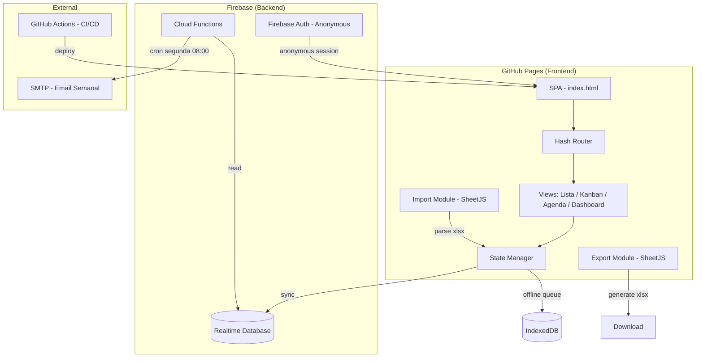
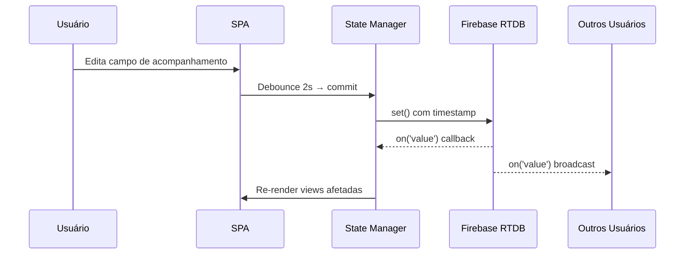
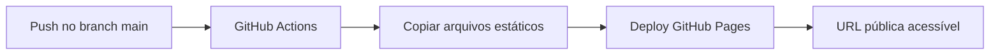

# Design Document: Deploy Client Tracking Panel

## Overview

O Painel de Acompanhamento de Clientes evoluirá de um arquivo HTML monolítico com dados hardcoded para uma Single Page Application (SPA) publicada no GitHub Pages, com backend compartilhado via Firebase Realtime Database. A aplicação permitirá que 4 membros do time de deploy (Bruno Hideo Toyama, Isabela Soares, Henrique Puertas Stefano, Ana Paula) acessem e editem simultaneamente os registros de acompanhamento de ~255 clientes.

### Decisões Técnicas Principais

| Decisão | Escolha | Justificativa |
|---------|---------|---------------|
| Framework Frontend | Vanilla JS + Web Components | Manter simplicidade, sem build step, deploy direto no GitHub Pages |
| Backend | Firebase Realtime Database (plano gratuito Spark) | Sincronização em tempo real, sem servidor próprio, tier gratuito atende 4 usuários |
| Importação Excel | SheetJS (xlsx) via CDN | Biblioteca madura para parsing .xlsx no navegador, sem backend |
| Exportação Excel | SheetJS (xlsx) | Mesma lib para gerar .xlsx client-side |
| Notificações Email | Firebase Cloud Functions + Nodemailer | Agendamento semanal serverless via cron trigger |
| Roteamento SPA | Hash-based routing (#/kanban, #/agenda) | Compatível com GitHub Pages sem configuração de fallback complexa |
| Estado local offline | IndexedDB via localForage | Armazenamento robusto para sincronização offline |

## Architecture

### Diagrama de Arquitetura



### Fluxo de Dados



### Estratégia de Deploy



## Components and Interfaces

### 1. Hash Router

```javascript
// router.js
class AppRouter {
  constructor(routes) {} // routes: { '#/': view, '#/kanban': view, ... }
  navigate(hash) {}     // Navega programaticamente
  getCurrentRoute() {}  // Retorna rota atual
  onRouteChange(cb) {}  // Callback de mudança de rota
}
```

**Rotas:**
- `#/` — Listagem de clientes (view padrão)
- `#/kanban` — Visualização Kanban
- `#/agenda` — Agenda de contatos
- `#/dashboard` — Dashboard com métricas (integrado no header)

### 2. State Manager

```javascript
// state.js
class StateManager {
  constructor(firebaseRef) {}
  
  // Leitura
  getClients() {}           // Retorna todos os clientes
  getClient(id) {}          // Retorna cliente por ID
  getFilters() {}           // Retorna filtros ativos
  
  // Escrita
  updateFollowUp(clientId, slotIndex, data) {} // Atualiza slot de acompanhamento
  setFilters(filters) {}    // Aplica filtros
  
  // Sync
  startSync() {}            // Inicia listener Firebase
  stopSync() {}             // Para listener
  getConnectionStatus() {}  // online | offline | syncing
  
  // Eventos
  on(event, callback) {}    // 'clients-updated', 'connection-change', 'conflict'
}
```

### 3. Firebase Service

```javascript
// firebase-service.js
class FirebaseService {
  constructor(config) {}
  
  // CRUD
  readClients() {}                          // Promise<Client[]>
  writeFollowUp(clientId, slot, data) {}    // Promise<void>
  writeClient(client) {}                    // Promise<void>
  
  // Real-time
  subscribeToChanges(path, callback) {}     // Unsubscribe fn
  
  // Metadata
  getLastImportDate(type) {}                // Promise<string>
  setLastImportDate(type, date) {}          // Promise<void>
  
  // Offline
  enablePersistence() {}                    // Habilita cache local Firebase
  getOfflineQueue() {}                      // Alterações pendentes
}
```

### 4. Import Module

```javascript
// import.js
class ImportService {
  // Projetos
  parseProjectsFile(file) {}    // File → ParseResult
  validateProjectsData(rows) {} // rows → ValidationResult
  mergeProjects(existing, imported) {} // Merge sem perder acompanhamentos
  
  // Eventos
  parseEventsFile(file) {}      // File → ParseResult
  validateEventsData(rows) {}   // rows → ValidationResult
  matchEventsToClients(events, clients) {} // Vincula eventos a clientes
  
  // Resultados
  generateImportSummary(result) {} // ImportSummary
}

// Tipos
interface ParseResult {
  success: boolean;
  rows: object[];
  errors: { line: number, message: string }[];
}

interface ValidationResult {
  valid: object[];
  invalid: { line: number, reason: string }[];
  missingColumns: string[];
}

interface ImportSummary {
  added: number;
  updated: number;
  unchanged: number;
  errors: { line: number, reason: string }[];
}
```

### 5. Export Module

```javascript
// export.js
class ExportService {
  generateExcel(clients, filters) {} // Gera arquivo .xlsx
  getFileName() {}                    // "acompanhamento_YYYY-MM-DD.xlsx"
  formatClientRow(client) {}          // Client → row object
}
```

### 6. Views

```javascript
// views/client-list.js - Listagem por cliente (expandível)
// views/kanban.js - Board com 5 colunas
// views/agenda.js - Timeline de próximos contatos
// views/dashboard.js - Cards de resumo (header)

class BaseView {
  constructor(container, stateManager) {}
  render(data) {}
  destroy() {}
  onFilterChange(filters) {}
}
```

### 7. Filter Engine

```javascript
// filters.js
class FilterEngine {
  constructor() {}
  
  applyFilters(clients, filters) {}  // Client[] → Client[] filtrado
  applySearch(clients, query) {}     // Busca parcial case-insensitive
  combineFilters(filters) {}         // AND entre categorias, OR dentro
  persistFilters(filters) {}         // Salva em sessionStorage
  restoreFilters() {}                // Restaura de sessionStorage
}

interface Filters {
  leader: string | null;      // Nome do líder
  phase: string | null;       // "Acompanhamento" | "Produção"
  status: string | null;      // "todos" | "pendentes" | "zero" | "completos"
  urgency: string | null;     // Ordenação por urgência
  search: string;             // Texto de busca
}
```

### 8. Notification Service (Cloud Function)

```javascript
// functions/weekly-email.js
exports.sendWeeklyEmail = functions.pubsub
  .schedule('0 8 * * 1')  // Segunda 08:00 UTC-3
  .timeZone('America/Sao_Paulo')
  .onRun(async (context) => {
    // 1. Ler dados do RTDB
    // 2. Calcular atrasados e previstos da semana
    // 3. Agrupar por líder
    // 4. Enviar email via Nodemailer
  });
```

## Data Models

### Cliente (Firebase RTDB)

```json
{
  "clients": {
    "{clientId}": {
      "codigo": 1939,
      "nome": "RM Participações Empresariais Ltda [vortex-nn]",
      "cliente": "RM Participações Empresariais Ltda",
      "email": "email@example.com",
      "telefone": "+55 (51) 99790-7341",
      "lider": "Bruno Hideo Toyama",
      "cidade": "Porto Alegre",
      "uf": "RS",
      "contrato": "01/06/2026",
      "status_projeto": "Acompanhamento",
      "inicio_capacitacao": "2026-07-13",
      "fim_capacitacao": "2026-07-18",
      "datas_previstas": ["2026-07-25", "2026-08-24", "2026-09-23", "2026-10-23"],
      "acompanhamentos_agenda": [
        {
          "data_iso": "2026-07-30",
          "data": "30/07/2026",
          "nome": "[vortex-nn] Acompanhamento",
          "dono": "Bruno Hideo Toyama",
          "futuro": true
        }
      ],
      "followUps": {
        "0": {
          "data": "2026-07-25",
          "contato_realizado": "sim",
          "canal": "whatsapp",
          "retorno": "Cliente confirmou uso da plataforma",
          "ocorreu": "sim",
          "detectado_agenda": false,
          "ultima_edicao": {
            "membro": "Bruno Hideo Toyama",
            "timestamp": 1690000000000
          }
        },
        "1": { ... },
        "2": { ... },
        "3": { ... }
      },
      "data_referencia_manual": null
    }
  },
  "metadata": {
    "lastImport": {
      "projetos": {
        "date": "15/07/2026 14:30",
        "by": "Isabela Soares"
      },
      "eventos": {
        "date": "15/07/2026 14:35",
        "by": "Isabela Soares"
      }
    }
  }
}
```

### Regras de Segurança Firebase

```json
{
  "rules": {
    "clients": {
      ".read": true,
      ".write": true
    },
    "metadata": {
      ".read": true,
      ".write": true
    }
  }
}
```

> **Nota:** Como o acesso é restrito ao time de 4 pessoas via URL privada (não indexada), regras abertas são aceitáveis. Autenticação anônima do Firebase é usada apenas para identificar sessões.

### Cálculos Derivados

| Métrica | Fórmula |
|---------|---------|
| Progresso do cliente | `count(followUps where ocorreu === "sim")` / 4 |
| Coluna Kanban | Baseado no count acima: 0→"Sem contato", 1→"1º", 2→"2º", 3→"3º", 4→"Completo" |
| Dias até próximo | `nextPendingDate - today` (negativo = atrasado) |
| Urgência | vermelho: dias < 0, amarelo: 0 ≤ dias ≤ 7, verde: dias > 7 |
| Total atrasados | `count(clients where nextPendingDate < today AND slot.ocorreu !== "sim")` |
| Não iniciados | `count(clients where nenhum followUp preenchido e nenhum contato)` |
| Em andamento | `count(clients where ao menos 1 contato/acompanhamento mas < 4 ocorridos)` |
| Completos | `count(clients where 4 followUps com ocorreu === "sim")` |

### Estrutura de Arquivos do Projeto

```
deploy-acompanhamento/
├── index.html              # Entry point SPA
├── 404.html                # Fallback para GitHub Pages SPA routing
├── css/
│   └── styles.css          # Estilos (paleta --forest, --clay, --gold)
├── js/
│   ├── app.js              # Bootstrap e inicialização
│   ├── router.js           # Hash-based SPA router
│   ├── state.js            # State manager com Firebase sync
│   ├── firebase-service.js # Wrapper Firebase RTDB
│   ├── filters.js          # Motor de filtros e busca
│   ├── import.js           # Importação Excel (SheetJS)
│   ├── export.js           # Exportação Excel (SheetJS)
│   └── views/
│       ├── client-list.js  # Vista de listagem
│       ├── kanban.js       # Vista Kanban
│       ├── agenda.js       # Vista Agenda
│       └── dashboard.js    # Cards de resumo
├── functions/              # Firebase Cloud Functions
│   ├── index.js            # Entry point
│   ├── weekly-email.js     # Notificação semanal
│   └── package.json
├── firebase.json           # Configuração Firebase
├── .firebaserc             # Projeto Firebase
├── .github/
│   └── workflows/
│       └── deploy.yml      # GitHub Actions → Pages
└── package.json            # Dependências dev (opcional)
```


## Correctness Properties

*A property is a characteristic or behavior that should hold true across all valid executions of a system—essentially, a formal statement about what the system should do. Properties serve as the bridge between human-readable specifications and machine-verifiable correctness guarantees.*

### Property 1: Last-write-wins conflict resolution

*For any* set of concurrent edits to the same client follow-up field, the final persisted value SHALL be the edit with the latest timestamp, regardless of the order in which edits arrive at the sync layer.

**Validates: Requirements 1.6, 1.7**

### Property 2: Import merge preserves follow-up data

*For any* existing client state with follow-up records and any valid project import data, after merge the follow-up records (`followUps`) of existing clients SHALL remain unchanged, while client metadata fields SHALL be updated to match the import.

**Validates: Requirements 2.3**

### Property 3: Event-to-client matching accuracy

*For any* set of imported events and existing clients, each event SHALL be matched to the correct client based on the project identifier pattern in the event name, and matched events SHALL pre-fill the corresponding follow-up slot with the event's date and inferred channel.

**Validates: Requirements 2.4, 10.5**

### Property 4: Import validation reports missing columns exactly

*For any* uploaded file with a subset of required columns missing, the validation error message SHALL list exactly the columns that are absent — no more, no less.

**Validates: Requirements 2.6**

### Property 5: Import summary count invariant

*For any* project import operation, the sum of `added + updated + unchanged` SHALL equal the total number of valid rows in the imported file.

**Validates: Requirements 2.7**

### Property 6: Invalid row isolation

*For any* imported file containing a mix of valid and invalid rows, only valid rows SHALL be processed into the database, and the error report SHALL contain exactly the line numbers of all invalid rows.

**Validates: Requirements 2.8**

### Property 7: Kanban column placement

*For any* client, the Kanban column SHALL be determined solely by the count of follow-up slots with `ocorreu === "sim"`: 0 → "Sem contato", 1 → "1º acompanhamento", 2 → "2º acompanhamento", 3 → "3º acompanhamento", 4 → "Completo (4/4)".

**Validates: Requirements 3.2, 3.3**

### Property 8: Urgency indicator calculation

*For any* client with a next pending follow-up date, the urgency indicator SHALL be: red if `(nextDate - today) < 0`, yellow if `0 ≤ (nextDate - today) ≤ 7`, green if `(nextDate - today) > 7`.

**Validates: Requirements 3.4, 3.6, 8.5**

### Property 9: Dashboard metrics consistency

*For any* set of clients, the dashboard SHALL satisfy: (a) `não_iniciados + em_andamento + completos = total_clients`, (b) `sum(per_leader_counts) = total_clients`, (c) `progresso = sum(all ocorreu="sim") / (total_clients × 4)`, and (d) `atrasados = count(slots where data_prevista < today AND ocorreu ≠ "sim")`.

**Validates: Requirements 4.1, 4.2, 4.3, 4.5**

### Property 10: Export produces filtered client data with all required columns

*For any* set of clients and any active filter state, the exported Excel file SHALL contain exactly one row per client that matches the current filters, and each row SHALL include all specified columns (nome, líder, fase, telefone, e-mail, cidade, estado, and for each of 4 slots: data, canal, ocorrência, retorno).

**Validates: Requirements 5.2, 5.3**

### Property 11: Email content correctness

*For any* set of clients on a given Monday, the weekly email SHALL list all clients with overdue follow-ups grouped by leader, all clients with follow-ups scheduled for the current week (Mon-Fri), and the correct progress ratio `(total_ocorreu / total_clients × 4)`.

**Validates: Requirements 6.2, 6.3**

### Property 12: Filter combination logic (AND between categories, OR within)

*For any* set of clients and any combination of filter selections, the resulting filtered set SHALL contain exactly the clients satisfying AND across filter categories (phase, leader, status) where within each category, the client matches at least one selected value (OR).

**Validates: Requirements 7.2, 7.4**

### Property 13: Search returns partial case-insensitive matches

*For any* client set and any search query string, the results SHALL include all and only clients where at least one of (nome, projeto, líder, cidade, estado) contains the query as a case-insensitive substring.

**Validates: Requirements 7.3**

### Property 14: Follow-up data round-trip

*For any* valid follow-up record (data in DD/MM/AAAA, contato_realizado ∈ {sim, não}, canal ∈ {WhatsApp, E-mail, Intercom}, retorno with ≤500 chars, ocorreu ∈ {sim, não}), saving and then reading back the record SHALL produce identical field values.

**Validates: Requirements 10.1**

### Property 15: Expected dates calculation

*For any* valid `fim_capacitacao` date, the system SHALL compute 4 expected follow-up dates as: 1st = `fim_capacitacao + 7 days`, 2nd = `1st + 30 days`, 3rd = `2nd + 30 days`, 4th = `3rd + 30 days`.

**Validates: Requirements 10.3**

### Property 16: Validation alert for inconsistent state

*For any* follow-up record where `ocorreu = "sim"` and `contato_realizado = "não"`, the system SHALL trigger a confirmation alert before saving. For all other combinations, no alert SHALL be triggered.

**Validates: Requirements 10.7**

## Error Handling

### Categorias de Erro

| Categoria | Comportamento | UI Feedback |
|-----------|---------------|-------------|
| Conexão Firebase perdida | Armazena alterações em IndexedDB, exibe banner offline | Banner amarelo "Modo offline — alterações serão sincronizadas" |
| Conexão restaurada | Sincroniza fila offline via last-write-wins | Flash verde "Sincronizado" |
| Arquivo importado inválido | Rejeita import, lista colunas ausentes | Modal com lista de erros |
| Linhas inválidas no import | Ignora linhas com erro, processa válidas | Resumo com contagem de erros e números de linha |
| Exportação falha (SheetJS) | Captura exceção, preserva dados na tela | Toast vermelho "Falha ao exportar" |
| CDN/SDK falha ao carregar | Exibe mensagem de fallback, interface básica funciona | Banner "Problema de conectividade" |
| Conflito de edição simultânea | Last-write-wins + notificação visual | Toast "Sua alteração foi sobrescrita por [nome]" |
| Envio de email semanal falha | Log no Firebase console, 3 retentativas em 10 min | (Sem UI — backend) |

### Estratégia de Debounce e Auto-save

```
Usuário edita campo
    ↓ (aguarda 2s sem atividade)
Salva no Firebase com timestamp
    ↓ (success callback)
Exibe indicador "Salvo ✓" por 2s
    ↓ (error callback)
Exibe "Erro ao salvar" + armazena em fila offline
```

### Offline Queue

- Alterações feitas offline são armazenadas em IndexedDB via localForage
- Cada entrada contém: `{ path, value, timestamp, memberId }`
- Na reconexão, a fila é processada sequencialmente
- Conflitos resolvidos por timestamp (last-write-wins)
- Fila limpa após confirmação de sync

## Testing Strategy

### Property-Based Tests (fast-check)

A biblioteca **fast-check** será utilizada para testes de propriedade em JavaScript/TypeScript.

Cada property test deve:
- Executar mínimo **100 iterações**
- Referenciar a propriedade do design document via tag
- Formato de tag: `Feature: deploy-client-tracking-panel, Property {N}: {título}`

**Propriedades a implementar:**

| # | Propriedade | Módulo Testado |
|---|-------------|----------------|
| 1 | Last-write-wins conflict resolution | state.js |
| 2 | Import merge preserves follow-ups | import.js |
| 3 | Event-to-client matching | import.js |
| 4 | Import validation reports missing columns | import.js |
| 5 | Import summary count invariant | import.js |
| 6 | Invalid row isolation | import.js |
| 7 | Kanban column placement | views/kanban.js |
| 8 | Urgency indicator calculation | views/kanban.js, filters.js |
| 9 | Dashboard metrics consistency | views/dashboard.js |
| 10 | Export filtered data with all columns | export.js |
| 11 | Email content correctness | functions/weekly-email.js |
| 12 | Filter combination logic | filters.js |
| 13 | Search partial case-insensitive | filters.js |
| 14 | Follow-up data round-trip | firebase-service.js |
| 15 | Expected dates calculation | state.js (cálculo de datas) |
| 16 | Validation alert for inconsistent state | state.js |

### Unit Tests (Vitest)

Cobertura com testes de exemplo para:
- Formatação de data (DD/MM/AAAA)
- Nome de arquivo de exportação (padrão YYYY-MM-DD)
- UI: existência de botões e tabs
- Debounce: salva após 2s de inatividade
- Offline indicator: aparece após 5s sem conexão
- Email "sem pendências" quando tudo está em dia

### Integration Tests

- Firebase RTDB: write → read verifica persistência
- Sync entre 2 conexões: alteração propaga em < 3 segundos
- Import .xlsx real: parse com SheetJS produz dados corretos
- Export .xlsx: arquivo gerado abre corretamente no Excel
- Cloud Function: trigger semanal executa e envia email

### E2E Tests (opcional, Playwright)

- Fluxo completo: abrir painel → importar → ver Kanban → exportar
- Responsividade: verificar layout em 1024px e 768px
- Filtros: aplicar combinação e verificar resultados

### Configuração de Testes

```json
{
  "devDependencies": {
    "vitest": "^1.0.0",
    "fast-check": "^3.0.0",
    "@vitest/coverage-v8": "^1.0.0"
  }
}
```

Comando: `npx vitest --run` (execução única, sem watch mode)
